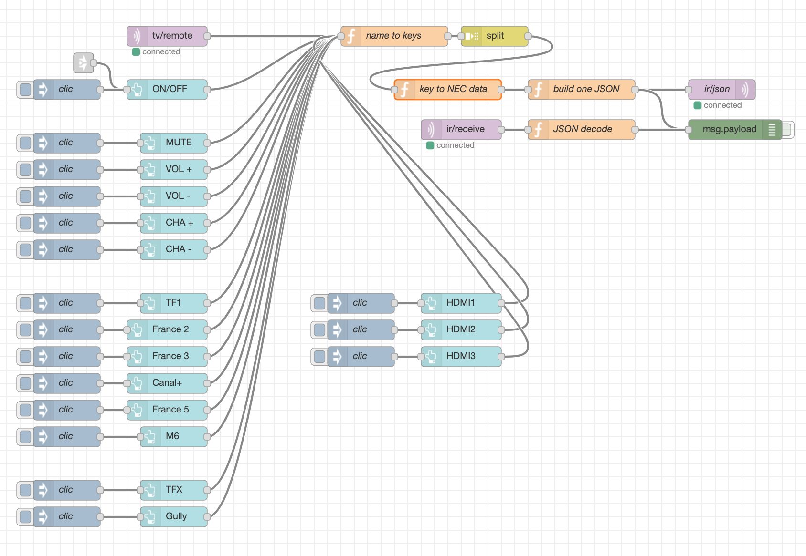

# MQTT IR Controller

please see this awesome project [https://github.com/mdhiggins/ESP8266-HTTP-IR-Blaster](ESP8266-HTTP-IR-Blaster)

I'd just removed HTTP / NTP / Alexa stuff et put MQTT inside.

With my Wemos DI this version is far more responsive than with HTTP / NTP etc. ...

But don't kill your TV with it! ;-)

Consider using [node-red](https://nodered.org/) for MQTT-comptabile devices coordination.

# Publish example : blazing fast!

With this project inside, you Wemos D1 or NodeMCU will blast when you publish to your MQTT broker like this :

3 pulses sequence example :

- topic  : ir/json
payload: {"type":"nec","length":32,"data":"2FD28D7"}

- topic  : ir/json
payload: {"type":"delay","rdelay":750}

- topic  : ir/json
payload: {"type":"nec","length":32,"data":"2FD28D7"}

using [mosquitto](https://mosquitto.org/man/mosquitto_pub-1.html) :
```bash
$ mosquitto_pub -h mqtt.local -t ir/json -m '{"type":"nec","length":32,"data":"2FD28D7"}'
$ mosquitto_pub -h mqtt.local -t ir/json -m '{"type":"delay","rdelay":750}'
$ mosquitto_pub -h mqtt.local -t ir/json -m '{"type":"nec","length":32,"data":"2FD28D7"}'
```

# Subscribe example : recording pulse JSON data

topic  : ir/receive

using [mosquitto](https://mosquitto.org/man/mosquitto_sub-1.html) :
```bash
$ mosquitto_sub -h mqtt.local -t ir/receive
{"type":"NEC","data":"2FDD827","length":32}
{"type":"NEC","data":"2FD00FF","length":32}
^C
```

# Node-red example

Please look inside [node-red-helpers](node-red-helpers).

